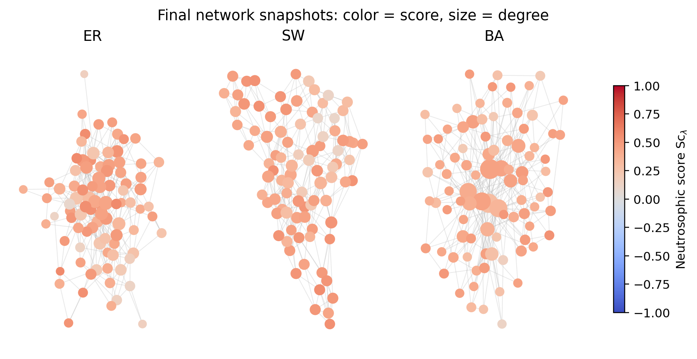
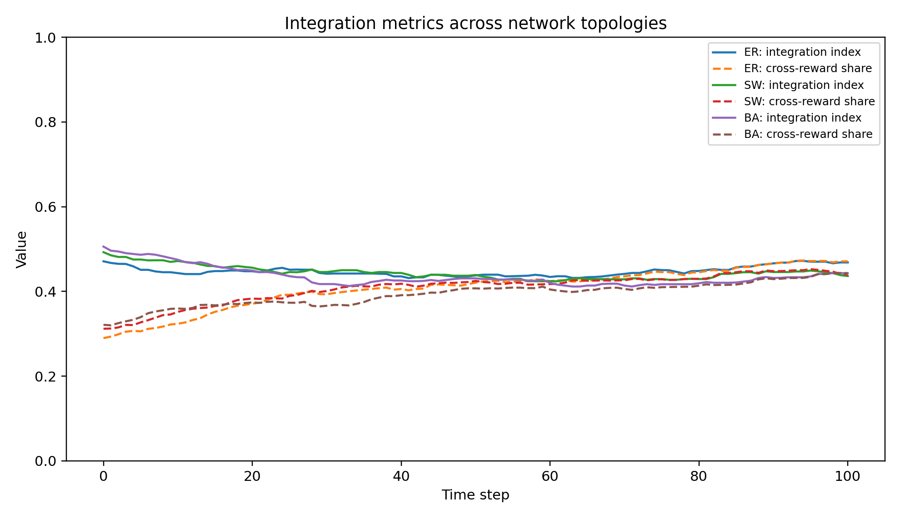
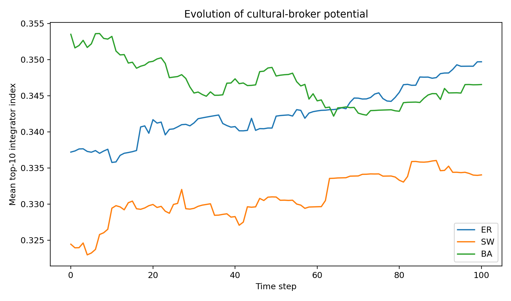
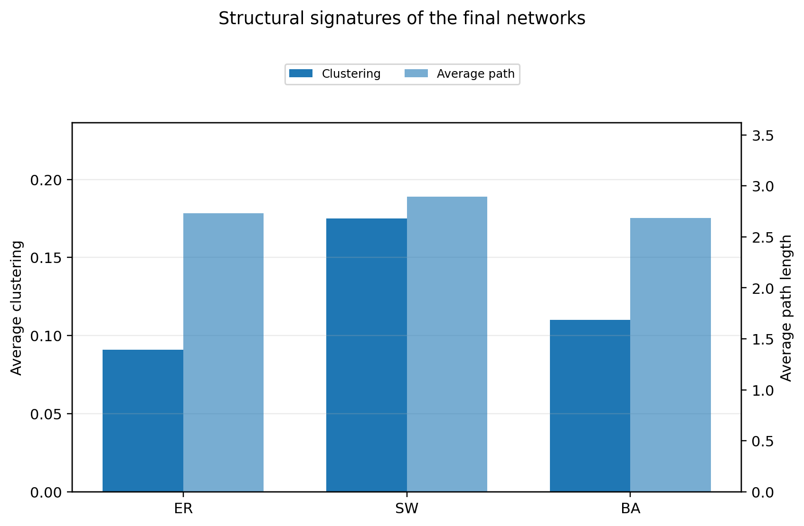
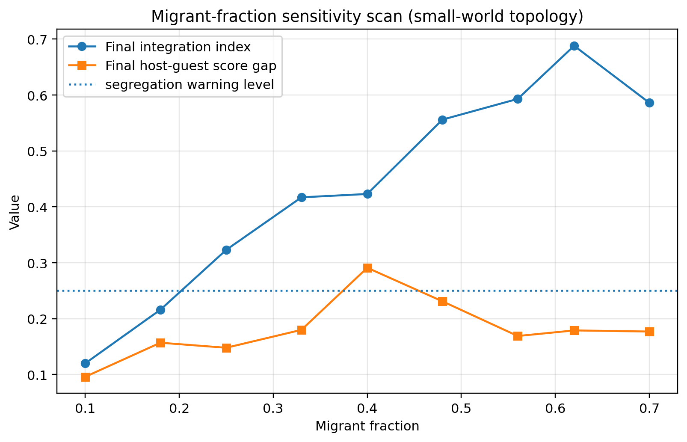

# Neutrosophic Immigration Model

[]()
[]()
[]()
[](https://github.com/giorgionordo/neutrosophic-immigration-model)

Python implementation of the model described in the manuscript

> **A Neutrosophic Agent-Based Network Model for Immigration and Coexistence**  
> Giorgio Nordo, Carmelo Filippo Munafò, Nivetha Martin.

The package implements a **single-valued neutrosophic agent-based network model** for studying host--guest interaction, integration, enclave formation, cultural brokerage, and migrant-fraction sensitivity in adaptive social networks.

The repository name is:

```text
neutrosophic-immigration-model
```

Repository URL:

```text
https://github.com/giorgionordo/neutrosophic-immigration-model
```

---

## Authors and contacts

| Author | Affiliation | Contact and identifiers |
|---|---|---|
| **Giorgio Nordo** | Department of Mathematical and Computer Sciences, Physical Sciences and Earth Sciences, University of Messina, Viale Ferdinando Stagno d'Alcontres 31, 98166 Messina, Italy | `giorgio.nordo@unime.it` · ORCID iD: [`0000-0002-9585-9680`](https://orcid.org/0000-0002-9585-9680) · Website: <https://www.nordo.it> |
| **Carmelo Filippo Munafò** | Department of Mathematical and Computer Sciences, Physical Sciences and Earth Sciences, University of Messina, Italy; Department of Industrial Engineering, University of Salerno, Fisciano, Italy; Department for the Promotion of Human Science and Quality of Life, San Raffaele University, Rome, Italy | `carmelofilippo.munafo@unime.it` · ORCID iD: [`0000-0003-3611-0941`](https://orcid.org/0000-0003-3611-0941) · Corresponding author |
| **Nivetha Martin** | Department of Mathematics, Arul Anandar College (Autonomous), Karumathur, Madurai, Tamil Nadu 625514, India; Dean of Research Institute, Arul Anandar College (Autonomous) | `nivetha.martin710@gmail.com` · ORCID iD: [`0000-0001-9942-1320`](https://orcid.org/0000-0001-9942-1320) · Scopus Author ID: `56939762600` |

---

## Mathematical and computational scope

The model replaces a scalar attitude variable with a **single-valued neutrosophic attitude**

```text
x_i(t) = <T_i(t), I_i(t), F_i(t)> in [0,1]^3
```

where:

- `T` represents integration-oriented acceptance;
- `I` represents indeterminacy, hesitation, or ambivalence;
- `F` represents segregation-oriented rejection.

The scalar score used for compatibility and rewiring is

```text
Sc_lambda(<T,I,F>) = T - lambda F - (1 - lambda) I
```

with `lambda in [0,1]`.

The repository implements:

- **SVNS attitudes** and score-based Gaussian compatibility;
- **dynamic social graphs** `G(t) = (V, E(t))`;
- **Erdős--Rényi**, **Watts--Strogatz small-world**, and **Barabási--Albert scale-free** initial topologies;
- **heterogeneous group rewards** for host--host, host--guest, guest--host, intra-guest, and inter-guest relations;
- **asymmetric directed appreciation strengths** on structurally undirected social ties;
- **capacity-dependent utility**, allowing high-utility or central agents to maintain more social links before overload costs appear;
- **reward-weighted SVNS attitude update**;
- **multi-agent Q-learning** for adaptive `keep`, `add`, and `delete` rewiring decisions;
- **DSmT-inspired trust aggregation** from common neighbours;
- **neutrosophic centrality and cultural-broker indicators**;
- **migrant-fraction sensitivity scans** for exploring possible neighbourhood-tipping thresholds.

---

## 2020 Mathematics Subject Classification

The manuscript uses the following MSC/AMS classification:

```text
Primary:   91D30, 05C82
Secondary: 05C80, 68T05, 91A80
```

Indicative interpretation:

- `91D30` — social networks and mathematical models in the social sciences;
- `05C82` — small-world and complex networks;
- `05C80` — random graphs;
- `68T05` — learning and adaptive systems;
- `91A80` — applications of game theory and decision models to social sciences.

---

## Repository structure

A typical local copy has the following structure:

```text
neutrosophic-immigration-model/
├── README.md
├── requirements.txt
├── pyproject.toml
├── src/
│   └── nsimmigration/
│       ├── __init__.py
│       ├── model.py
│       ├── plotting.py
│       └── svns.py
├── scripts/
│   └── run_experiments.py
└── docs/
    └── figures/
        ├── fig_network_snapshots.png
        ├── fig_topology_metrics.png
        ├── fig_integrator_evolution.png
        ├── fig_topology_structure.png
        └── fig_tipping.png
```

The folder `docs/figures/` is optional and is used only for README preview images. The reproducible figures are generated by the scripts and can be saved in any output folder, for example `figures/`.

---

## Installation

Clone the repository:

```bash
git clone https://github.com/giorgionordo/neutrosophic-immigration-model.git
cd neutrosophic-immigration-model
```

Create and activate a virtual environment.

On Linux/macOS:

```bash
python -m venv .venv
source .venv/bin/activate
```

On Windows PowerShell:

```powershell
python -m venv .venv
.\.venv\Scripts\Activate.ps1
```

Install the dependencies:

```bash
pip install -r requirements.txt
```

For local package-style execution, also install the project in editable mode:

```bash
pip install -e .
```

---

## Quick start

Run the complete experiment pipeline:

```bash
python scripts/run_experiments.py --output figures
```

This generates the main simulation outputs and saves the figures as PNG files in the selected output folder.

Typical generated figures are:

```text
fig_network_snapshots.png
fig_topology_metrics.png
fig_integrator_evolution.png
fig_topology_structure.png
fig_tipping.png
```

---

## Example Python usage

```python
from nsimmigration import ModelConfig, NeutrosophicImmigrationModel

cfg = ModelConfig(
    topology="sw",
    seed=42,
    n_steps=100,
)

model = NeutrosophicImmigrationModel(cfg)
history = model.run()

print(history["I_int"][-1])
print(history["v_out"][-1])
print(history["score_gap"][-1])
```

To compare topologies:

```python
from nsimmigration import ModelConfig, NeutrosophicImmigrationModel

histories = {}

for label, topology in [("ER", "er"), ("SW", "sw"), ("BA", "ba")]:
    cfg = ModelConfig(topology=topology, seed=42, n_steps=100)
    model = NeutrosophicImmigrationModel(cfg)
    histories[label] = model.run()
```

---

## Main outputs

Each run records time series and final aggregate quantities such as:

| Quantity | Meaning |
|---|---|
| `I_int` | normalized structural integration index |
| `v_out` | normalized cross-group reward index |
| `score_gap` | host--migrant neutrosophic score gap |
| `clustering` | average clustering coefficient |
| `avg_path` | average path length, computed on the largest connected component if needed |
| `top_integrator_mean` | mean value of the top cultural-broker / integrator indices |

The numerical experiments in the manuscript use these outputs to compare random, small-world, and scale-free topologies.

---

## Preview figures

The figures below are documentation previews. They can be regenerated by running the experiment script.

### Final network snapshots

Node colour encodes the neutrosophic score `Sc_lambda`; node size is proportional to degree.



### Integration metrics across topologies

Solid lines represent the integration index; dashed lines represent the normalized cross-group reward index.



### Cultural-broker potential

Evolution of the mean value of the ten largest integrator indices.



### Structural signatures

Final clustering coefficient and average path length for the three topologies.



### Migrant-fraction sensitivity scan

Sensitivity of final integration and host--migrant score gap with respect to the migrant fraction.



---

## Scientific notes

The simulations are intended as **methodological and exploratory experiments**, not as calibrated predictions for a specific country or region.

The model is designed to study how the following mechanisms interact:

1. neutrosophic uncertainty in individual attitudes;
2. adaptive rewiring of social ties;
3. heterogeneous rewards among host and migrant groups;
4. trust-based link formation;
5. hub-mediated influence in scale-free networks;
6. weak bridges in small-world networks;
7. possible critical transitions detected by migrant-fraction scans.

A scalar model may only register a change in mean attitude. The SVNS representation distinguishes acceptance, rejection, and indeterminacy, making it possible to represent intermediate or pre-integration phases in which uncertainty increases before stable coexistence emerges.

---

## Reproducibility checklist

For reproducible runs:

1. use a fixed random seed;
2. report the topology (`er`, `sw`, or `ba`);
3. report the population size and group composition;
4. report the values of `lambda`, `sigma`, `kappa_0`, `beta`, and `eta`;
5. save the output folder together with the corresponding configuration;
6. regenerate figures through `scripts/run_experiments.py`.

---

## Troubleshooting

### `ModuleNotFoundError: No module named 'nsimmigration'`

Install the package in editable mode from the repository root:

```bash
pip install -e .
```

Alternatively, run scripts from the repository root.

### Figures are not updated

Delete or rename the previous output folder and run:

```bash
python scripts/run_experiments.py --output figures
```

### PyCharm or virtual-environment files appear in `git status`

Make sure that `.gitignore` contains at least:

```gitignore
.idea/
.venv/
venv/
__pycache__/
*.py[cod]
figures/
paper/
```

---

## Citation

If you use this code, please cite the related manuscript and the repository.

### Repository citation

```bibtex
@misc{nordo2026neutrosophicimmigrationmodel,
  author       = {Nordo, Giorgio and Munaf{\`o}, Carmelo Filippo and Martin, Nivetha},
  title        = {neutrosophic-immigration-model: Python implementation of a neutrosophic agent-based network model for immigration and coexistence},
  year         = {2026},
  howpublished = {\url{https://github.com/giorgionordo/neutrosophic-immigration-model}},
  note         = {Accessed 16 August 2026}
}
```

### Manuscript citation

```bibtex
@article{nordo2026neutrosophicimmigration,
  author  = {Nordo, Giorgio and Munaf{\`o}, Carmelo Filippo and Martin, Nivetha},
  title   = {A Neutrosophic Agent-Based Network Model for Immigration and Coexistence},
  year    = {2026},
  note    = {Manuscript}
}
```

Update the manuscript entry with journal, volume, pages, and DOI after publication.

---

## License

Add the repository license here. If no license file is present, the code is not automatically open-source for reuse under standard GitHub conventions.

Recommended options for academic reproducibility are:

- MIT License, for permissive reuse;
- BSD-3-Clause, for permissive reuse with attribution;
- GPL-3.0, if derivative code should remain open.

---

## Acknowledgement

This software accompanies the mathematical and computational development of the neutrosophic immigration and coexistence model. The related research acknowledges the support of G.N.S.A.G.A. of Istituto Nazionale di Alta Matematica (INdAM) “F. Severi”, Italy.
